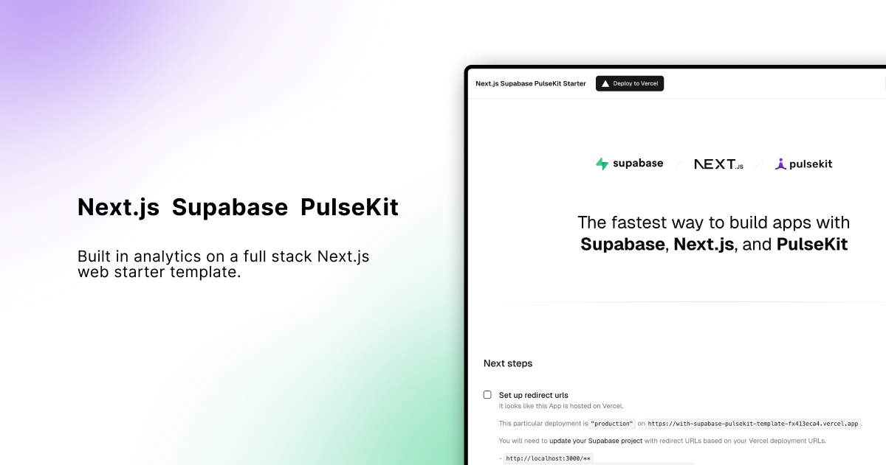

<h1 align="center">Next.js + Supabase + PulseKit Starter</h1>

<br/>
<p align="center">
  
</p>
<br/>

<divider />
<p align="center">
  The fastest way to build apps with Next.js, Supabase, and privacy-friendly analytics
</p>

<p align="center">
  <a href="#features"><strong>Features</strong></a> &middot;
  <a href="#demo"><strong>Demo</strong></a> &middot;
  <a href="#deploy-to-vercel"><strong>Deploy to Vercel</strong></a> &middot;
  <a href="#clone-and-run-locally"><strong>Clone and Run Locally</strong></a> &middot;
  <a href="#project-structure"><strong>Project Structure</strong></a>
</p>
<br/>

This template extends the official [Next.js Supabase Starter](https://github.com/vercel/next.js/tree/canary/examples/with-supabase) with [PulseKit](https://github.com/benoiteom/pulsekit) — a lightweight, privacy-friendly analytics toolkit that stores all data in your own Supabase database.

## Features

- **Next.js App Router** — works across Server Components, Client Components, Route Handlers, Server Actions, and Middleware
- **Supabase Auth** — cookie-based authentication via `@supabase/ssr`, with password-based auth from the [Supabase UI Library](https://supabase.com/ui/docs/nextjs/password-based-auth)
- **PulseKit Analytics** — automatic page view tracking, Web Vitals (LCP, INP, CLS, FCP, TTFB), error reporting, and geo-location stats
- **Analytics Dashboard** — built-in dashboard at `/admin/analytics` with password-protected access
- **Data Lifecycle** — automatic aggregation and cleanup of old raw events to keep your database lean
- **Security Hardened** — RLS policies with minimum-privilege grants per role, validated event types on insert
- **Tailwind CSS + shadcn/ui** — styled with [Tailwind CSS](https://tailwindcss.com) and [shadcn/ui](https://ui.shadcn.com/) components

## Demo

<!-- TODO: Replace with your live demo URL -->
You can view a fully working demo at [https://with-supabase-pulsekit-template.vercel.app/](https://with-supabase-pulsekit-template.vercel.app/).

## Deploy to Vercel

Vercel deployment will guide you through creating a Supabase account and project. After installation of the Supabase integration, all relevant environment variables will be assigned to the project so the deployment is fully functioning.

[](https://vercel.com/new/clone?repository-url=https%3A%2F%2Fgithub.com%2Fbenoiteom%2Fwith-supabase-pulsekit&project-name=nextjs-supabase-pulsekit&repository-name=with-supabase-pulsekit&demo-title=Next.js+Supabase+PulseKit&demo-description=Next.js+starter+with+Supabase+auth+and+PulseKit+privacy-friendly+analytics.&demo-url=https://with-supabase-pulsekit-template.vercel.app&external-id=https%3A%2F%2Fgithub.com%2Fbenoiteom%2Fwith-supabase-pulsekit)

After deploying, you will still need to:

1. Set the `PULSE_SECRET` environment variable in Vercel (a 16+ character password for your analytics dashboard)
2. Set the `SUPABASE_SERVICE_ROLE_KEY` environment variable in Vercel
3. Run the database migrations (see [below](#3-run-database-migrations))

## Clone and Run Locally

### 1. Create a Supabase project

Create a new project via the [Supabase dashboard](https://database.new).

### 2. Clone the repository

```bash
git clone https://github.com/benoiteom/with-supabase-pulsekit.git
cd with-supabase-pulsekit
npm install
```

### 3. Set up environment variables

Rename `.env.example` to `.env.local` and fill in the values:

```env
NEXT_PUBLIC_SUPABASE_URL=your-project-url
NEXT_PUBLIC_SUPABASE_PUBLISHABLE_KEY=your-publishable-or-anon-key
PULSE_SECRET=your-analytics-dashboard-password
SUPABASE_SERVICE_ROLE_KEY=your-service-role-key
```

> [!NOTE]
> `NEXT_PUBLIC_SUPABASE_URL` and `NEXT_PUBLIC_SUPABASE_PUBLISHABLE_KEY` can be found in [your Supabase project's API settings](https://supabase.com/dashboard/project/_?showConnect=true). `SUPABASE_SERVICE_ROLE_KEY` is in the same place under "Service Role". `PULSE_SECRET` is a password you create (16+ characters) to protect your analytics dashboard.

### 4. Run database migrations

Link your Supabase project and push the PulseKit schema:

```bash
npx supabase link
npx supabase db push
```

This creates the `analytics` schema with tables for events and aggregates, plus RPC functions for querying stats.

### 5. Start the development server

```bash
npm run dev
```

The app should now be running on [localhost:3000](http://localhost:3000/).

## Project Structure

```
├── app/
│   ├── admin/analytics/     # PulseKit analytics dashboard (password-protected)
│   ├── api/pulse/           # Analytics API routes (ingestion, auth, aggregation, cleanup)
│   ├── auth/                # Supabase auth pages (login, sign-up, callback, etc.)
│   └── protected/           # Example protected page
├── components/
│   ├── pulse-tracker-wrapper.tsx  # PulseKit tracker (auto page views, vitals, errors)
│   └── tutorial/            # Setup guide shown on the home page
├── instrumentation.ts       # Server-side error reporting via PulseKit
├── lib/supabase/            # Supabase client helpers and middleware proxy
└── supabase/migrations/     # SQL migrations for the analytics schema
```

### How PulseKit Works in This Template

- **Tracking** — `PulseTrackerWrapper` in the root layout automatically captures page views, Web Vitals, and client-side errors. No manual instrumentation needed.
- **Server Errors** — `instrumentation.ts` uses `createPulseErrorReporter` to capture server-side errors via Next.js's `onRequestError` hook.
- **Ingestion** — Events are sent to `/api/pulse` which writes them to the `analytics.pulse_events` table in Supabase.
- **Dashboard** — `/admin/analytics` renders the `PulseDashboard` component, protected by `PulseAuthGate` (uses `PULSE_SECRET`).
- **Data Lifecycle** — `/api/pulse/consolidate` rolls old raw events into daily aggregates and cleans up, keeping your database lean.

## Feedback and Issues

- PulseKit: [github.com/benoiteom/pulsekit/issues](https://github.com/benoiteom/pulsekit/issues)
- Supabase: [github.com/supabase/supabase/issues](https://github.com/supabase/supabase/issues/new/choose)
